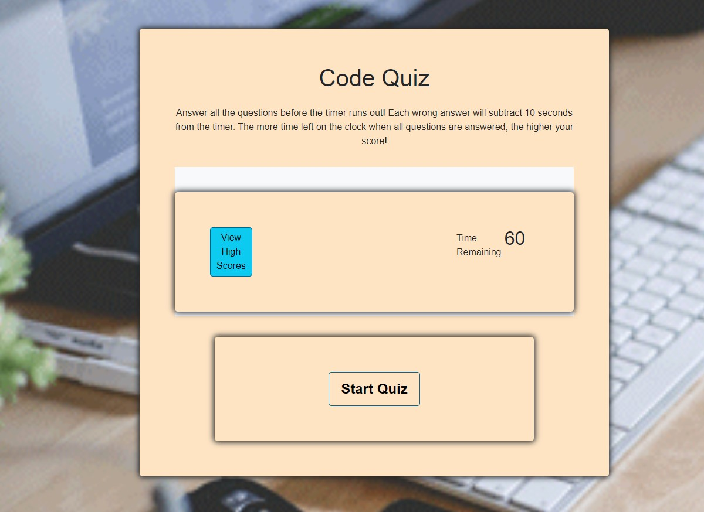

# codequizFDH

A timed coding quiz page using HTML, CSS, Bootstrap, and Javascript.
## Table of Contents

- [Installation](#installation)
- [Usage](#usage)
- [Roadmap](#roadmap)
- [Contributions](#contributions)
- [Questions](#questions)

## Installation

Deployed application:

https://harrisfd.github.io/codequizFDH/
## Usage

This is a timed quiz with multiple choice questions on Javascript.  This app is using HTML, CSS, Bootstrap, and JavaScript. User taking the quiz will have 60 seconds to complete. For each question answered incorrectly, the timer will subtract 10 seconds. Once the timer reaches zero then the quiz is over. Users can save their initials and score.  A list of high scores will be listed once they click “ view high scores”.

## Roadmap

Continuous updates will help to improve the overall look and feel of the page.  Additional questions will be added to help test user’s knowledge on coding. Continue to update graphics and navigation bar, additional work will be added. 

## Contributions
No contributions at this time.
## Questions
Please email fharrisfoster@gmail.com for any questions.
